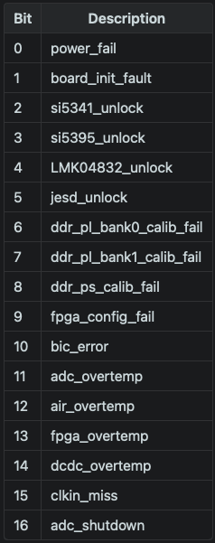

# CLIQ - Coherent Liquid argon Iu daQ

This application is meant to be used with CAEN VX2740 digitizers for the
COH-Ar-750 experiment. It wraps the CAEN FELib header file with Rust code
and has a simple UI to monitor data-taking. The output files are HDF5.
Below are details on how to install the code, the structure of the code
for those looking to understand it and make changes and the structure of
the HDF5 files for use in analysis.

## Installation

Make sure your system has Rust installed (the best way is via [rustup](https://rustup.rs/)).
You will then want to make sure the appropriate CAEN libraries are installed:
- CAEN VMELib
- CAEN FELib
- CAEN Dig2

Modify the first `println!` statement in the `build.rs` file to point to the correct
directory where those libraries are installed.

Typing `cargo install --path .` will install the binary to `~/.cargo/bin` and will make
it available to use anywhere.

## How to run

The `config.toml` file is an example of the only file that needs to be included to run
the program. The program is invoked as `cliq --config <config_file>` (which can also be
found by just running `cliq` or `cliq --help` and the program usage and help information
will be shown). The configuration file has different sections with notes on the available
options. The configuration file is in TOML format, see [here](https://toml.io/en/) for
its specifications. The program is designed to take the single configuration file and
loop indefinitely, creating new runs after the specified run duration in the config file.
The user can exit the program to load a new configuration file by pressing `q`. The program
automatically handles creating new runs and incrementing the run numbers appropriately.

### Run settings

General run settings such as the digitizers to use, how long runs should be, and where data
should be written to.

- `boards`: This is where you list the URLs or USB connections to the digitizer boards as an array
of strings
- `run_duration`: How long a run should last in seconds
- `output_dir`: Where the data files should be written to
- `campaign_num`: The campaign number, separate from the run number, so there can be two runs
with the same number but they will have different campaign numbers
(These next options will be moved to a separate section in the future)
- `zs_level`: What percentage of events should never be zero suppressed. This is done using a random
number generator pulling from a uniform distribution (0.0, 1.0]
- `zs_threshold`: After computing the baseline of a waveform this is the threshold level in ADC above
baseline for which to write zeros
- `zs_edge`: Specify whether the pulses are positive- or negative-going
- `zs_samples`: The number of samples to use at the beginning of the waveform to compute the baseline

### Board settings

This is comprised of different sections. The first, `common`, are settings common to each digitizer while
an array of tables of `boards` specifies the settings for each individual board. The sections are
delineated by `[board_settings.common]` and as many `[[board_settings.boards]]` sections as you need.

#### Common

- `record_len`: The waveform length in number of samples
- `pre_trig_len`: The number of samples to take before the trigger

#### Boards

- `en_chans`: Either "true", or an array of numbers specifying which channels to enable, basically if the
self trigger should be on
- `trig_source`: A string that specifies which trigger sources the board should be trigger on
- `io_level`: "TTL" or "NIM"
- `test_pulse_*`: Test pulse parameters to use when "TestPulse" is selected as a trigger source
- `dc_offset`: Can be a single number for each channel or a "map" where each channel has its own DC offset
- `trig_thr`: What threshold to use for internal triggering
- `trig_thr_mode`: "Relative" or "Absolute"
- `trig_edge`: "Fall" or "Rise"
- `samples_over_thr`: Number of samples of threshold to self-trigger
- `itl_*`: The various parameters related to ITL logic

### Sync settings

These options facilitate syncing the clocks and/or triggers of multiple boards. Similar to `[[board_settings.boards]]`
above the settings for each board is done by `[[sync_settings.boards]]` with the following options

- `clock_src`: Digitizer clock source
- `sync_out`: Sync signal to send out
- `start_src`: What to use as the start run source
- `clock_out_fp`: Whether to enable the clock out of the front panel of the digitizer
- `trig_out`: What signal to send on the trigger out
- `auto_disarm`: Whether to enable auto-disarm acquisition when the run stops

## Code structure

## Output file format

The output file format for data is HDF5, chosen because that Rust library had the most support and
features (like file compression) when compared to the Rust `oxyroot` library that reads and writes
ROOT files. It does still offer good library support for analysis, like in Python, and has the similar
ability as ROOT to only read in certain amounts of data from disk rather than all the file at once.
Currently the structure of the output files are
- `/`: Root of file
  - `/board{id}`: Data relating to board with ID
    - `/board{id}/timestamps`: Timestamps of events in ns
    - `/board{id}/waveforms`: Waveforms from board as 2D array, always has 64 channels (rows)
    with `record_len` samples (columns)
    - `/board{id}/triggerids`: Trigger IDs of events
    - `/board{id}/flags`: A 16 bit number specifying error flags, see  for the
    corresponding errors
    - `/board{id}/boardfail`: Whether the board was in a fail state when the event was read
